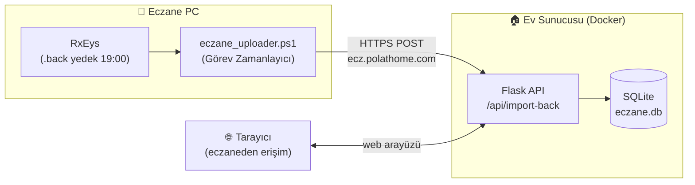

# 💊 Eczane Muhasebe

Eczane için **günlük kasa mutabakat** uygulaması. Banka (POS), nakit, iban, iade ve
tahsilat kalemlerini gün gün girersiniz; uygulama toplamları hesaplar, RxEys sistem
verileriyle (`.back` yedeği) karşılaştırıp **farkı** otomatik çıkarır ve aylık raporu
Excel olarak verir.

---

## ✨ Özellikler

- 📅 **Aylık tablo** — her gün için banka/nakit/iade/tahsilat girişi, anlık toplam hesabı
- 🧮 **Otomatik fark** — RxEys sistem değerleriyle karşılaştırma (kasada fazla/eksik)
- 🎨 **Renkli vurgular** — fark > 0 yeşil, < 0 kırmızı; iade/tahsilat hücreleri renkli
- 🙈 **Gün gizleme** — hafta günü (örn. Pazar) veya tek tek tarih bazlı; gizli günler ekran, toplam ve Excel'de tamamen yok sayılır
- 📊 **Formüller menüsü** — tüm hesaplama formüllerini tek ekranda gösterir
- 📥 **RxEys içe aktarma** — Excel veya doğrudan `.back` (PostgreSQL yedeği) dosyasından
- 🤖 **Otomatik senkron** — izlenen klasöre düşen `.back`/Excel dosyalarını otomatik çeker
- 📤 **Excel dışa aktarma** — biçimlendirilmiş aylık rapor
- 🐳 **Docker** ile tek komutla çalışır

---

## 🏗️ Mimari

Uygulama **evdeki sunucuda** Docker içinde çalışır; eczaneden web tarayıcısıyla
`ecz.polathome.com` üzerinden erişilir. Günlük `.back` yedeği eczane PC'sinden
otomatik olarak sunucuya yüklenir.



**Veri akışı:** RxEys her akşam `.back` yedeği üretir → `eczane_uploader.ps1` saat 19:00'da
bu dosyayı `https://ecz.polathome.com/api/import-back` adresine gönderir → sunucu
PostgreSQL yedeğini ayrıştırıp günlük nakit/banka değerlerini veritabanına yazar.

---

## 🚀 Kurulum

### Sunucu (ev) — Docker

```bash
git clone https://github.com/ismailpolatt/eczane-muhasebe.git
cd eczane-muhasebe
docker compose up -d
```

Uygulama `http://<sunucu-ip>:5001` adresinde çalışır. (`docker-compose.yml` içinde
port `5001:5000`, veri `./data` klasöründe kalıcıdır.)

### Manuel (Docker'sız)

```bash
pip install -r requirements.txt
python app.py        # http://localhost:5000
```

---

## 🤖 Eczane tarafı otomatik yükleyici

`.back` yedeklerini eczaneden eve **otomatik** taşımak için
[`tools/eczane_uploader.ps1`](tools/eczane_uploader.ps1) script'i kullanılır.
Bulut (Drive/OneDrive) gerekmez — sunucu eczaneden erişilebildiği için yeterli.

**Kurulum:**

1. `tools/eczane_uploader.ps1` dosyasını eczane PC'sine kopyalayın
2. Script içindeki `$WatchFolder` değerini RxEys'in `.back` kaydettiği klasörle değiştirin
3. **Görev Zamanlayıcı** (taskschd.msc) → Temel Görev Oluştur:
   - **Tetikleyici:** Günlük, saat **19:00**
   - **Program:** `powershell.exe`
   - **Argüman:** `-NoProfile -ExecutionPolicy Bypass -File "C:\yol\eczane_uploader.ps1"`

> 19:00'da PC kapalı olabiliyorsa görev özelliklerinde *"Kaçırılan görevi mümkün
> olduğunca çalıştır"* seçeneğini işaretleyin.

**Alternatifler:** Manuel ".back Yükle" butonu (arayüzden) veya bir bulut senkron
klasörünü (Drive/OneDrive) "Otomatik" menüsünde izleme.

---

## 🧮 Hesaplama Formülleri

| Değer | Formül |
|-------|--------|
| **Banka Toplam** | `teb + vakifbank − iade_banka − tahsilat_banka` |
| **Nakit Toplam** | `nakit + iban − iade_nakit − tahsilat_nakit + cikan` |
| **Genel Toplam** | `banka_top + nakit_top` |
| **RX Toplam** | `rx_banka + rx_nakit` |
| **Fark Banka** | `banka_top − rx_banka` |
| **Fark Nakit** | `nakit_top − rx_nakit` |
| **Toplam Fark** | `fark_banka + fark_nakit` |

- **Çıkan:** kasadan çıkan nakit (gider); elde görünmesi için nakit toplama eklenir
- **Fark > 0:** kasada fazla • **Fark < 0:** kasada eksik
- Bu tablo uygulama içindeki **Formüller** butonundan da görüntülenebilir

---

## 📁 Proje Yapısı

```
eczane-muhasebe/
├── app.py                      # Flask API + rotalar
├── static/index.html           # Tek sayfa arayüz (tablo, modallar)
├── utils/
│   ├── excel_generator.py      # Aylık Excel raporu
│   ├── excel_parser.py         # RxEys Excel ayrıştırıcı
│   ├── back_parser.py          # .back (PostgreSQL yedeği) ayrıştırıcı
│   ├── watcher.py              # Klasör izleyici (otomatik senkron)
│   └── holidays.py             # Türkiye resmi tatilleri
├── tools/
│   └── eczane_uploader.ps1     # Eczane PC otomatik yükleyici
├── docker-compose.yml
├── Dockerfile
└── requirements.txt
```

---

## 🛠️ Teknolojiler

Python · Flask · SQLite · openpyxl · Docker · PowerShell
